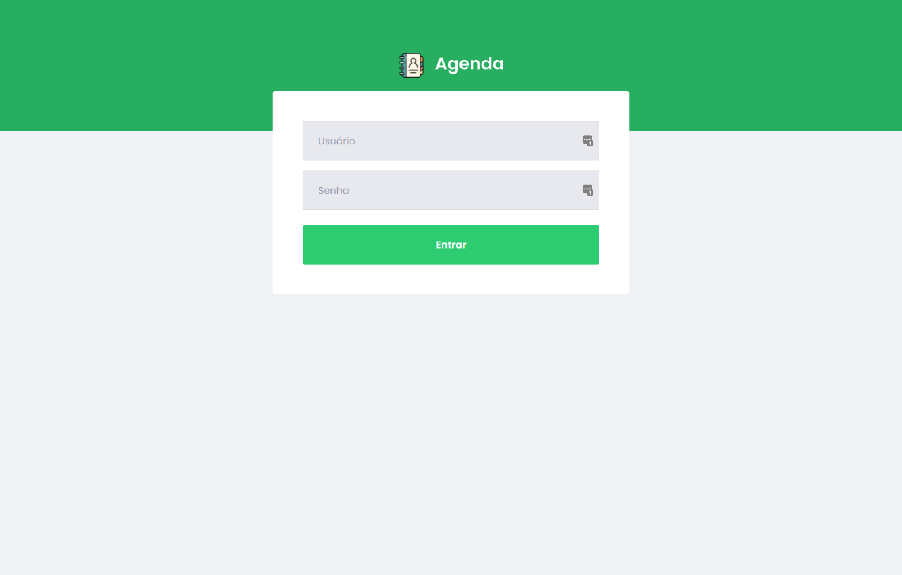
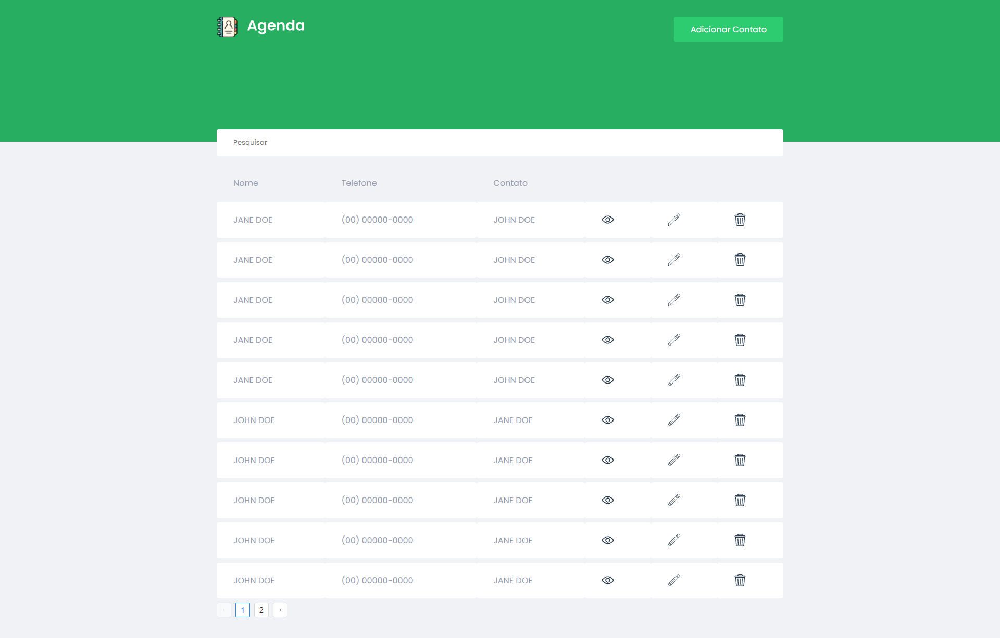
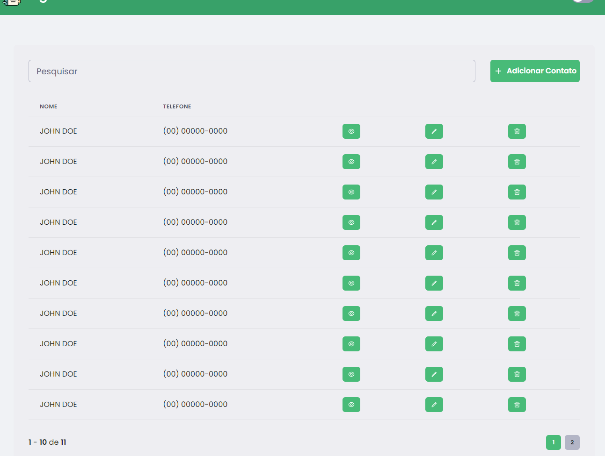
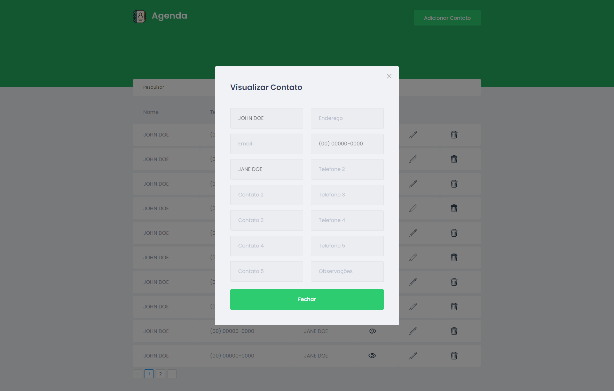

<h1 align="center">
    
</h1>

<p align="center">
   <a href="https://www.linkedin.com/in/samuel-ferreira-rezende-7bbbba206/">
      
   </a>
  
  
  
  
  <a href="mailto:samuelferreirarezende@gmail.com">
   
  </a>
</p>

<p align="center">
  📗 Manage people info
</p>

<div align="center">
  <sub> Made by
    <a href="https://github.com/SamuelFR7">Samuel Rezende.
  </sub>
</div>


# 📌 Contents

* [Screenshots](#camera-screenshot) 
* [Technologies](#rocket-technologies) 
* [How to Run](#computer-how-to-run)
* [Issues](#bug-issues)
* [Contributing](#sparkles-issues)
* [License](#page_facing_up-license)

# :camera: Screenshots
<div align="center">
   
   
   
   
</div>

# :rocket: Technologies
This project was made using the follow technologies:

* [Typescript](https://www.typescriptlang.org/)      
* [React](https://reactjs.org/)      
* [Styled Components](https://styled-components.com/)
* [ExpressJS](https://expressjs.com/)
* [MongoDB](https://www.mongodb.com)

# :computer: How to run

```bash
# Clone Repository
$ git clone https://github.com/SamuelFR7/agenda-react.git
```

```bash
# Install Dependencies in backend and frontend
$ yarn

# Run Aplication in backend in frontend
$ yarn start
```
Go to http://localhost:3000/ to see the result.

# :page_facing_up: License

This project is under the [MIT license](./LICENSE).
Made with 💖 by [Samuel Rezende](https://www.linkedin.com/in/samuel-ferreira-rezende-7bbbba206/). 

Thank You! 🚀