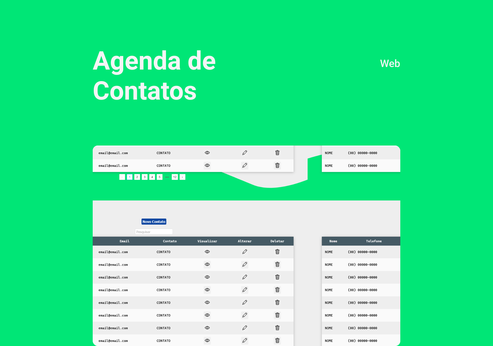

<h1 align="center">
    
</h1>

<p align="center">
  <a href="/LICENSE">
      
  </a>  
</p>

<br>

## 🧪 Tecnologias

O projeto foi desenvolvido usando as seguintes tecnologias: 

- [Node](https://nodejs.org)
- [Mongo](https://www.mongodb.com/)
- [NextJS](https://nextjs.org/)
- [TypeScript](https://www.typescriptlang.org/)

## 🚀 Como executar
Requisitos: 
- [Node](https://nodejs.org)
- [MongoDB](https://www.mongodb.com/)


Clone o projeto e acesse a pasta dele.

```bash
$ git clone https://github.com/SamuelFR7/agenda-react.git
$ cd agenda-react
```

Para iniciá-lo, siga os passos abaixo:
```bash
# Backend:
$ cd backend
$ yarn
$ yarn dev
```
```bash
# Frontend:
$ cd frontend
$ yarn 
$ yarn dev
```
O backend estará disponível em http://localhost:3333, enquanto você pode acessar o frontend pelo browser no endereço: http://localhost:3000

## 💻 Projeto

Essa agenda é feita para empresas armazenarem as informações de contato de seus funcionários e contatos constantemente utilizados, de forma organizada, com autenticação de usuários para o seu acesso.

## 📝 License

Esse projeto está sob a licença MIT. Veja o arquivo [LICENSE](LICENSE) para mais detalhes.

---

Feito por Samuel Rezende [Linkedin](https://www.linkedin.com/in/samuel-ferreira-rezende-7bbbba206/)
